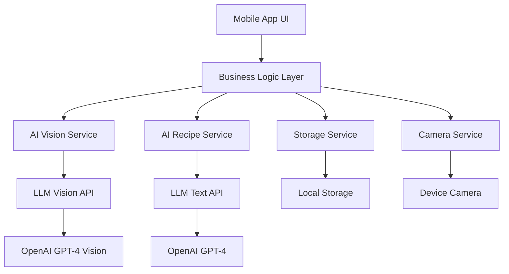

# Design Document

## Overview

The Food Recognition App is a hybrid mobile application built using Flutter framework to ensure cross-platform compatibility and easy maintenance. Flutter offers faster development time, excellent performance, and a single codebase for both iOS and Android. The app integrates AI/LLM services for food recognition and recipe generation, eliminating the need for multiple third-party APIs and providing more flexible, context-aware responses. The architecture follows a modular design with clear separation between UI components, business logic, and AI service integrations.

### Subscription Model

To manage AI service costs and provide sustainable access, the app will implement a tiered subscription model:

1. **Free Tier**
   - 1 free scan per 6 hours
   - Option to watch ads for additional scans (up to 3 additional scans per day)
   - Basic recipe suggestions
   - Ad-supported experience
   - Limited history storage (7 days)

2. **Premium Tier** ($4.99/month)
   - 5 free scans per day
   - Option to watch ads for additional scans (up to 10 additional scans per day)
   - Advanced recipe suggestions with variations
   - Ad-free experience (except optional ad viewing for extra scans)
   - Extended history storage (30 days)
   - Recipe Book functionality - save and organize favorite recipes
   - Recipe sharing capabilities

3. **Professional Tier** ($9.99/month)
   - Unlimited food recognition scans
   - Priority processing
   - Advanced dietary customization
   - Full Recipe Book functionality with unlimited storage
   - Meal Planning features with daily nutrient tracking
   - Shopping list generation from meal plans
   - Unlimited history and favorites
   - Premium customer support

The subscription system will track usage quotas, handle payment processing, and manage feature access based on the user's subscription level.

### OpenAI Integration

The app will use OpenAI's APIs for both food recognition and recipe generation:

1. **Food Recognition**: GPT-4 Vision API will analyze food images to identify ingredients with confidence scores
2. **Automatic Recipe Generation**: GPT-4 API will automatically generate 5 most relevant recipes ranked by ingredient match percentage, including:
   - Detailed cooking instructions with step-by-step guidance
   - Comprehensive nutrition information (calories, macronutrients, micronutrients)
   - Allergen detection and warnings (nuts, dairy, gluten, shellfish, etc.)
   - Intolerance identification (lactose, gluten, etc.)
   - Ingredient highlighting showing which detected ingredients are used
   - Alternative recipe suggestions when no exact matches are found
   - Dietary restriction compatibility

The OpenAI integration will use structured prompts to ensure consistent, detailed responses that include all required nutrition and safety information. The system will automatically trigger recipe generation immediately after successful ingredient identification, providing users with instant cooking suggestions.

## Architecture

### High-Level Architecture



### Technology Stack

- **Frontend Framework**: Flutter
- **State Management**: Provider, Riverpod, or Bloc
- **Navigation**: Flutter Navigator 2.0 or GoRouter
- **Camera Integration**: camera plugin
- **HTTP Client**: dio or http package
- **Local Storage**: shared_preferences or sqflite
- **Image Processing**: Base64 encoding for API transmission
- **Food Recognition**: OpenAI GPT-4 Vision API
- **Recipe Generation**: OpenAI GPT-4 API

## Components and Interfaces

### Core Components

#### 1. Camera Component
```typescript
interface CameraComponentProps {
  onPhotoCapture: (imageUri: string) => void;
  isProcessing: boolean;
}

interface CameraService {
  capturePhoto(): Promise<string>;
  requestPermissions(): Promise<boolean>;
  checkPermissions(): Promise<boolean>;
}
```

#### 2. Food Recognition Component
```typescript
interface FoodRecognitionResult {
  ingredients: Ingredient[];
  confidence: number;
  processingTime: number;
}

interface Ingredient {
  name: string;
  confidence: number;
  category: string;
}

interface FoodRecognitionService {
  analyzeImage(imageUri: string): Promise<FoodRecognitionResult>;
  validateImageQuality(imageUri: string): boolean;
}
```

#### 3. Recipe Component
```typescript
interface Recipe {
  id: string;
  title: string;
  ingredients: string[];
  instructions: string[];
  cookingTime: number;
  servings: number;
  matchPercentage: number;
  imageUrl?: string;
  nutrition: NutritionInfo;
  allergens: Allergen[];
  intolerances: Intolerance[];
  usedIngredients: string[]; // Ingredients from photo that are used in this recipe
  missingIngredients: string[]; // Additional ingredients needed
  difficulty: 'easy' | 'medium' | 'hard';
}

interface RecipeGenerationResult {
  recipes: Recipe[];
  totalFound: number;
  generationTime: number;
  alternativeSuggestions?: Recipe[]; // For when no exact matches found
}

interface NutritionInfo {
  calories: number;
  protein: number;
  carbohydrates: number;
  fat: number;
  fiber: number;
  sugar: number;
  sodium: number;
  servingSize: string;
}

interface Allergen {
  name: string;
  severity: 'low' | 'medium' | 'high';
  description: string;
}

interface Intolerance {
  name: string;
  type: 'lactose' | 'gluten' | 'nuts' | 'shellfish' | 'eggs' | 'soy' | 'other';
  description: string;
}

interface RecipeService {
  generateRecipesByIngredients(ingredients: string[]): Promise<RecipeGenerationResult>;
  getTopRecipes(ingredients: string[], limit: number): Promise<Recipe[]>;
  rankRecipesByMatch(recipes: Recipe[], userIngredients: string[]): Recipe[];
  findAlternativeRecipes(ingredients: string[]): Promise<Recipe[]>;
  highlightUsedIngredients(recipe: Recipe, detectedIngredients: string[]): Recipe;
}
```

#### 4. Ingredient Management Component
```typescript
interface IngredientManager {
  detectedIngredients: Ingredient[];
  customIngredients: string[];
  addCustomIngredient(ingredient: string): void;
  removeCustomIngredient(ingredient: string): void;
  getAllIngredients(): string[];
}
```

#### 5. Recipe Book Service
```typescript
interface RecipeBookService {
  saveRecipe(recipe: Recipe, category?: string, tags?: string[]): Promise<void>;
  getSavedRecipes(): Promise<SavedRecipe[]>;
  deleteRecipe(recipeId: string): Promise<void>;
  searchSavedRecipes(query: string): Promise<SavedRecipe[]>;
  categorizeRecipes(category: string): Promise<SavedRecipe[]>;
}
```

#### 6. Meal Planning Service
```typescript
interface MealPlanningService {
  createMealPlan(name: string, startDate: string, type: 'weekly' | 'monthly'): Promise<MealPlan>;
  addMealToPlan(planId: string, meal: PlannedMeal): Promise<void>;
  getMealPlans(): Promise<MealPlan[]>;
  getMealPlan(planId: string): Promise<MealPlan>;
  deleteMealPlan(planId: string): Promise<void>;
  calculateDailyNutrients(planId: string, date: string): Promise<DailyNutrients>;
  setNutritionGoals(userId: string, goals: NutritionGoals): Promise<void>;
  getNutritionProgress(planId: string, date: string): Promise<NutritionProgress>;
}
```

#### 7. Sharing Service
```typescript
interface SharingService {
  shareRecipe(recipe: Recipe, platform: 'social' | 'email' | 'messaging'): Promise<void>;
  generateShareableContent(recipe: Recipe): string;
  shareImage(recipe: Recipe): Promise<string>;
}
```

#### 8. Onboarding Service
```typescript
interface OnboardingService {
  isFirstLaunch(): Promise<boolean>;
  markOnboardingComplete(): Promise<void>;
  resetOnboarding(): Promise<void>;
  getCurrentOnboardingStep(): Promise<number>;
  setOnboardingStep(step: number): Promise<void>;
  shouldShowPermissionExplanation(): Promise<boolean>;
}

interface OnboardingStep {
  id: number;
  title: string;
  description: string;
  visualDemo?: string;
  skipable: boolean;
}
```

#### 9. Subscription Service
```typescript
interface SubscriptionService {
  getCurrentSubscription(): Promise<SubscriptionTier>;
  hasFeatureAccess(feature: FeatureType): Promise<boolean>;
  upgradeSubscription(tier: SubscriptionTier): Promise<boolean>;
  cancelSubscription(): Promise<boolean>;
  getUsageQuota(): Promise<UsageQuota>;
  incrementUsage(type: UsageType): Promise<void>;
  canPerformAction(action: ActionType): Promise<boolean>;
}

interface SubscriptionTier {
  type: 'free' | 'premium' | 'professional';
  features: FeatureType[];
  quotas: UsageQuota;
  price: number;
  billingPeriod: 'monthly' | 'yearly';
}

interface UsageQuota {
  dailyScans: number;
  usedScans: number;
  resetTime: Date;
  adWatchesAvailable: number;
  historyDays: number;
}

enum FeatureType {
  RECIPE_BOOK = 'recipe_book',
  MEAL_PLANNING = 'meal_planning',
  UNLIMITED_SCANS = 'unlimited_scans',
  AD_FREE = 'ad_free',
  PRIORITY_PROCESSING = 'priority_processing'
}

enum ActionType {
  SCAN_FOOD = 'scan_food',
  SAVE_RECIPE = 'save_recipe',
  CREATE_MEAL_PLAN = 'create_meal_plan',
  WATCH_AD = 'watch_ad'
}
```

### Screen Components

#### 1. Onboarding Screens
- Welcome screen with app introduction and value proposition
- Feature demonstration screens with visual examples (3-4 screens)
- Permission request screens with clear explanations for camera access
- Demo scan feature for first-time users to try the app
- Skip functionality available on each screen
- Progress indicators showing onboarding completion status

#### 2. Home Screen
- Camera preview and capture button
- Recent photos/results quick access
- Navigation to settings and help
- Quick access to recipe book and meal planning (subscription-based)

#### 3. Results Screen
- Detected ingredients list with confidence scores
- Recipe suggestions grid/list with match percentages
- Add custom ingredients interface
- Share and save options (save requires Premium+ subscription)
- Retry option for failed recognition

#### 4. Recipe Detail Screen
- Full recipe display with ingredients and instructions
- Comprehensive nutrition information display
- Allergen warnings and intolerance indicators
- Cooking timer integration
- Save to recipe book option (Premium+ only)
- Recipe sharing functionality
- Add to meal plan option (Professional only)

#### 5. Recipe Book Screen (Premium+ Only)
- Saved recipes grid/list view with categories
- Search and filter functionality
- Custom category and tag organization
- Recipe management options (edit, delete, share)
- Upgrade prompts for Free tier users

#### 6. Meal Planning Screen (Professional Only)
- Calendar view for meal planning with drag-and-drop interface
- Recipe selection interface from recipe book
- Meal plan creation and editing tools
- Daily nutrition dashboard with progress tracking
- Nutrition goals setting and monitoring
- Shopping list generation from meal plans
- Upgrade prompts for non-Professional users

#### 7. Settings Screen
- Camera preferences and permissions
- Subscription management and billing
- Privacy settings and data management
- Onboarding replay option
- App information and support

## Data Models

### Application State
```typescript
interface AppState {
  camera: CameraState;
  recognition: RecognitionState;
  recipes: RecipeState;
  user: UserState;
  onboarding: OnboardingState;
  subscription: SubscriptionState;
}

interface CameraState {
  isActive: boolean;
  hasPermission: boolean;
  lastCapturedImage?: string;
}

interface RecognitionState {
  isProcessing: boolean;
  results?: FoodRecognitionResult;
  error?: string;
}

interface RecipeState {
  suggestions: Recipe[];
  selectedRecipe?: Recipe;
  isLoading: boolean;
  customIngredients: string[];
  generationResult?: RecipeGenerationResult;
  alternativeSuggestions: Recipe[];
  isGeneratingRecipes: boolean;
  lastGenerationTime?: number;
}

interface UserState {
  preferences: UserPreferences;
  favoriteRecipes: string[];
  recentSearches: string[];
  recipeBook: SavedRecipe[];
  mealPlans: MealPlan[];
}

interface OnboardingState {
  isFirstLaunch: boolean;
  currentStep: number;
  isComplete: boolean;
  hasSeenPermissionExplanation: boolean;
}

interface SubscriptionState {
  currentTier: SubscriptionTier;
  usageQuota: UsageQuota;
  isLoading: boolean;
  lastUpdated: Date;
}
```

### Local Storage Schema
```typescript
interface StoredData {
  userPreferences: UserPreferences;
  favoriteRecipes: Recipe[];
  recentIngredients: string[];
  appSettings: AppSettings;
  onboardingData: OnboardingData;
  subscriptionData: SubscriptionData;
}

interface OnboardingData {
  isComplete: boolean;
  completedSteps: number[];
  lastShownStep: number;
  hasSeenPermissionExplanation: boolean;
  completionDate?: string;
}

interface SubscriptionData {
  currentTier: string;
  subscriptionId?: string;
  purchaseDate?: string;
  expiryDate?: string;
  usageHistory: UsageRecord[];
  lastQuotaReset: string;
}

interface UsageRecord {
  date: string;
  scansUsed: number;
  adsWatched: number;
  actionType: string;
}

interface UserPreferences {
  dietaryRestrictions: string[];
  preferredCuisines: string[];
  skillLevel: 'beginner' | 'intermediate' | 'advanced';
}

interface SavedRecipe extends Recipe {
  savedDate: string;
  category: string;
  tags: string[];
  personalNotes?: string;
}

interface MealPlan {
  id: string;
  name: string;
  startDate: string;
  endDate: string;
  type: 'weekly' | 'monthly';
  meals: PlannedMeal[];
  dailyNutrients: DailyNutrients[];
}

interface PlannedMeal {
  date: string;
  mealType: 'breakfast' | 'lunch' | 'dinner' | 'snack';
  recipeId: string;
  servings: number;
}

interface DailyNutrients {
  date: string;
  totalCalories: number;
  totalProtein: number;
  totalCarbohydrates: number;
  totalFat: number;
  totalFiber: number;
  totalSugar: number;
  totalSodium: number;
  nutritionGoals?: NutritionGoals;
  goalProgress?: NutritionProgress;
}

interface NutritionGoals {
  dailyCalories: number;
  dailyProtein: number;
  dailyCarbohydrates: number;
  dailyFat: number;
  dailyFiber: number;
  dailySodium: number;
}

interface NutritionProgress {
  caloriesProgress: number; // percentage
  proteinProgress: number;
  carbsProgress: number;
  fatProgress: number;
  fiberProgress: number;
  sodiumProgress: number;
}
```

## Error Handling

### Error Categories

1. **Camera Errors**
   - Permission denied
   - Hardware unavailable
   - Capture failure

2. **Network Errors**
   - API service unavailable
   - Timeout errors
   - Rate limiting

3. **Processing Errors**
   - Invalid image format
   - No food detected
   - Service processing failure

4. **Data Errors**
   - Storage failures
   - Corrupted preferences
   - Invalid recipe data

5. **Subscription Errors**
   - Payment processing failures
   - Subscription verification failures
   - Usage quota exceeded
   - Feature access denied

6. **Onboarding Errors**
   - Permission request failures
   - Demo scan failures
   - Navigation errors

### Error Handling Strategy

```typescript
interface ErrorHandler {
  handleCameraError(error: CameraError): void;
  handleNetworkError(error: NetworkError): void;
  handleProcessingError(error: ProcessingError): void;
  showUserFriendlyMessage(error: AppError): void;
}

interface AppError {
  type: ErrorType;
  message: string;
  recoverable: boolean;
  retryAction?: () => void;
}
```

### Retry Logic
- Automatic retry for network failures (max 3 attempts)
- User-initiated retry for processing failures
- Graceful degradation when services are unavailable
- Offline mode messaging for network-dependent features

## Testing Strategy

### Unit Testing
- Component rendering and behavior
- Service layer functionality
- State management logic
- Utility functions and helpers

### Integration Testing
- Camera integration with device hardware
- API service integration
- Local storage operations
- Navigation flow between screens

### End-to-End Testing
- Complete photo-to-recipe workflow
- Cross-platform functionality verification
- Performance testing under various network conditions
- User experience validation

### Testing Tools
- **Unit Tests**: Flutter Test framework with mockito
- **Integration Tests**: Flutter Integration Test or Patrol
- **API Testing**: HTTP mocking with mockito or nock
- **Performance Testing**: Flutter DevTools or Firebase Performance Monitoring

### Test Coverage Goals
- Minimum 80% code coverage for business logic
- 100% coverage for critical paths (photo capture, API calls)
- Cross-platform testing on iOS and Android simulators
- Real device testing for camera functionality

### Continuous Integration
- Automated testing on pull requests
- Platform-specific build validation
- Performance regression testing
- Security vulnerability scanning